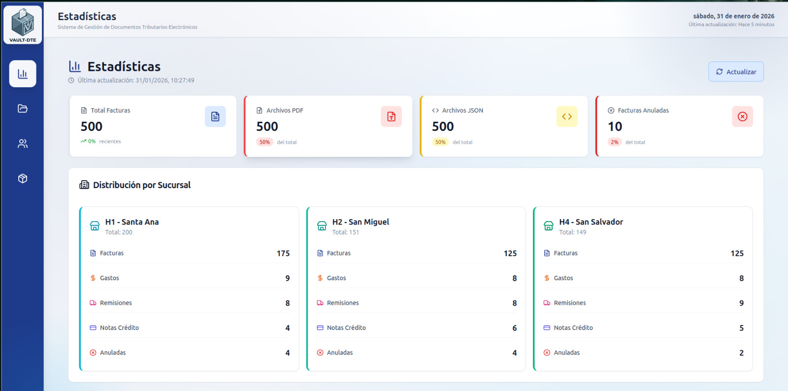
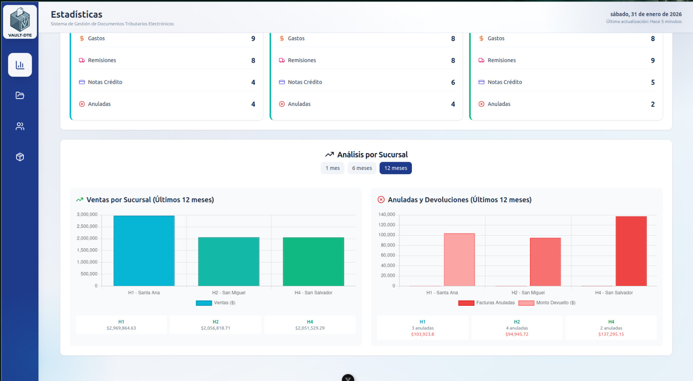
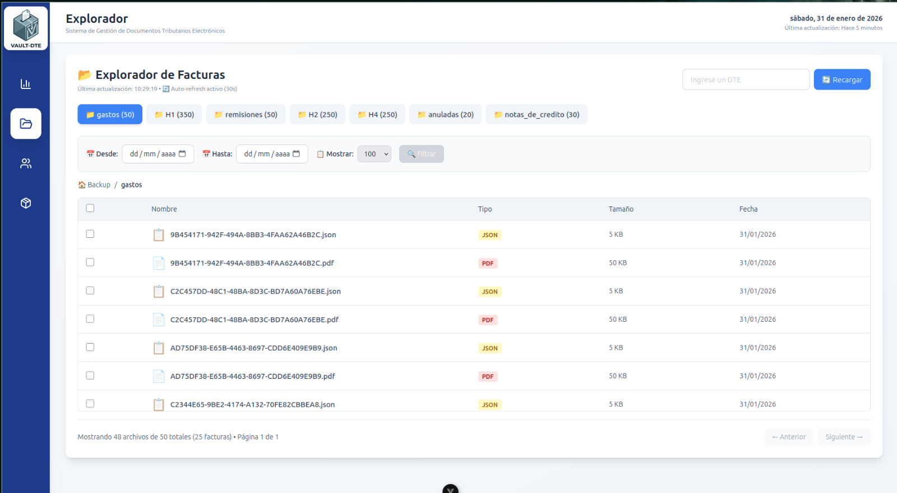
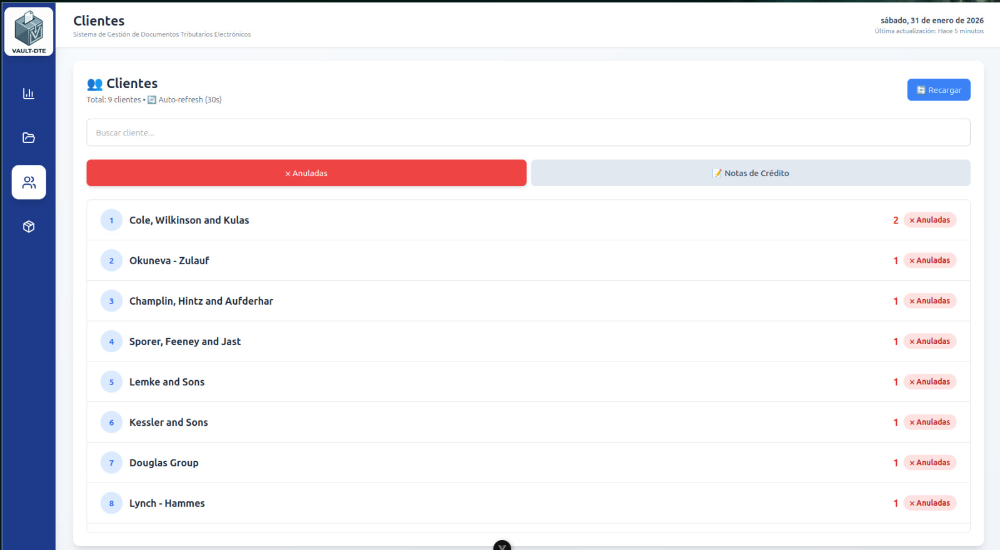
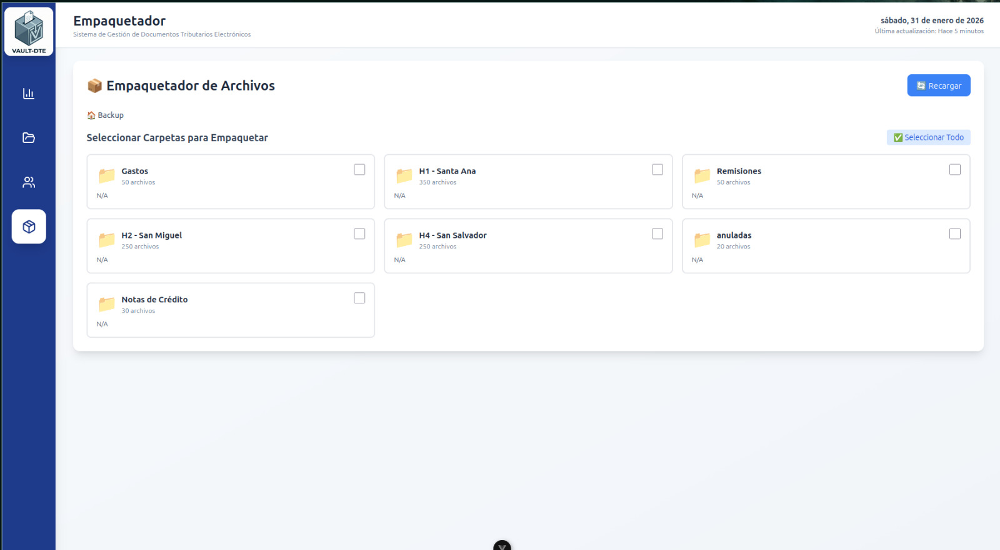

================================================================================

          ██╗   ██╗ █████╗ ██╗   ██╗██╗  ████████╗    ██████╗ ████████╗███████╗
          ██║   ██║██╔══██╗██║   ██║██║  ╚══██╔══╝    ██╔══██╗╚══██╔══╝██╔════╝
          ██║   ██║███████║██║   ██║██║     ██║       ██║  ██║   ██║   █████╗
          ╚██╗ ██╔╝██╔══██║██║   ██║██║     ██║       ██║  ██║   ██║   ██╔══╝
           ╚████╔╝ ██║  ██║╚██████╔╝███████╗██║       ██████╔╝   ██║   ███████╗
            ╚═══╝  ╚═╝  ╚═╝ ╚═════╝ ╚══════╝╚═╝       ╚═════╝    ╚═╝   ╚══════╝

================================================================================

              Transformando Cumplimiento Tributario en Inteligencia de Negocio

================================================================================

# VAULT-DTE

Plataforma de Inteligencia Fiscal y Gestión de Facturación Electrónica

Vault-DTE es una solución full-stack empresarial diseñada para convertir 10,000+ facturas electrónicas en datos accionables. Permite buscar, analizar y reportar información fiscal en segundos.

Desarrollado durante mi pasantía en Hermaco, logrando impacto real en producción.

---

## 📸 CAPTURAS DE PANTALLA

**Dashboard Principal**


**Dashboard Secundario**


**Explorador Avanzado**


**Visor de Clientes**


**Descargador Masivo**


## ⚡ IMPACTO Y RESULTADOS (ROI)

| Métrica          | Antes          | Con Vault-DTE | Mejora  |
| ---------------- | -------------- | ------------- | ------- |
| Búsqueda de Docs | 5-10 minutos   | < 5 segundos  | ⚡ 90%  |
| Reportes         | 2 horas        | Instantáneo   | 🚀 100% |
| Escalabilidad    | ~100 registros | 10,000+       | 📈 100x |
| Descargas        | Manual (1 a 1) | Masiva (ZIP)  | ✅ Auto |

---

## 🛠️ STACK TECNOLÓGICO

| Área     | Tecnologías                                       |
| -------- | ------------------------------------------------- |
| Frontend | Vue 3, TypeScript, UnoCSS, Pinia (Store), Vite    |
| Backend  | Node.js, Express, Archiver (Streaming ZIP)        |
| Datos    | Dual: MongoDB (Producción) / JSON Estático (Demo) |
| Docs     | Swagger UI (OpenAPI 3.0)                          |

---

## 🧠 ARQUITECTURA DUAL: DEMO VS PRODUCCIÓN

El sistema implementa una arquitectura única para facilitar tanto el desarrollo como la demostración en portafolios:

### MODO PRODUCCIÓN

- Conectado a MongoDB
- Maneja datos reales
- Agregaciones complejas
- Seguridad por variables de entorno

### MODO DEMO (SANDBOX)

- Utiliza Mock Data (JSON)
- No requiere base de datos
- Funciona "out-of-the-box" al clonar el repo
- 100% seguro para mostrar públicamente

---

## ✨ CARACTERÍSTICAS CLAVE

✓ **Búsqueda Instantánea**
Filtros por código, cliente, fecha o estado optimizados

✓ **Dashboard Analytics**
Estadísticas en tiempo real por sucursal y tipo de documento

✓ **Gestor de Descargas**
Empaquetado inteligente de PDFs en ZIP sin saturar la memoria del servidor (Implementación con Streams)

✓ **Documentación Viva**
API totalmente documentada y comprobable con Swagger

---

## 🚀 INSTALACIÓN Y USO

### REQUISITOS PREVIOS

- Node.js 16+
- Git
- MongoDB (opcional - solo para modo Producción)

### PASO 1: CLONAR REPOSITORIO

```bash
git clone https://github.com/tu-usuario/vault-dte.git
cd vault-dte
```

### PASO 2: INSTALAR DEPENDENCIAS

```bash
npm install
```

### PASO 3: INICIAR (MODO DEMO POR DEFECTO)

```bash
npm run dev:all
```

### ACCESOS DISPONIBLES

- 💻 **Frontend**: http://localhost:5173
- 📡 **API Backend**: http://localhost:3001
- 📚 **Swagger Docs**: http://localhost:3001/api-docs

---

## 📦 ESTRUCTURA DEL PROYECTO

```
vault-dte/
├── server/
│   ├── mock-data/              Datos sintéticos (Modo Demo)
│   ├── models/                 Esquemas Mongoose (Modo Prod)
│   ├── index.js                Entry point agnóstico
│   └── index.production.js      Versión con MongoDB
│
├── src/
│   ├── modules/                Arquitectura modular
│   │   ├── Explorer/           Búsqueda y visualización
│   │   ├── Statistics/         Dashboard analítico
│   │   └── Clients/            Gestión de clientes
│   │
│   ├── stores/                 Estado global con Pinia
│   ├── App.vue                 Componente raíz
│   └── main.js                 Punto de entrada
│
└── docs/                       Documentación extendida
```

---

## 👨‍💻 AUTOR

**Henri**  
Desarrollador Full Stack especializado en Soluciones Empresariales

- **LinkedIn**: [www.linkedin.com/in/boris-funes-653159214](https://www.linkedin.com/in/boris-funes-653159214)
- **Portfolio**: [https://github.com/Henri-Funes](https://github.com/Henri-Funes)

---

## 📄 LICENCIA

MIT License - Libre para uso educativo y profesional
